# CH569 Hacking: Basics

The first obvious thing you notice when you see the
[EVB](https://aliexpress.com/item/1005005566535207.html) for the first
time is that **IT'S DUAL STACKED!!**. Yes, what you see is what you get.
You actually get those two boards exactly like as seen in the picture.

The product description on Aliexpress is not so kind to explain what's
going on, so you have to refer to the board documentation to get some
clues. Once again, the doc is not well written and that's why I started
writing the tutorial. I'll help you walk you through it.

They're not the same board stacked on top of each other. The boards are
**NOT** in the same configuration. WCH probably made the EVB like that
to showcase the HSPI(High Speed Parallel Interface). If you don't need
HSPI, the boards can be separated and run on their own.

## Board Configuration

The differences between the upper and lower boards are discussed here.

From page 3 of the EVB reference pdf:

> Note: There are two cases for HSPI, choose the upper board or the
> lower board according to the different resistors soldered. Solder
> R32/R33 on the upper board, or solder R34/R35 on the lower board.
> R32/R33 and R34/R35 should not be soldered simultaneously.

Still no idea? That's okay. There isn't enough information in the doc so
you need to actually have a look at the board to what the heck is going
on.

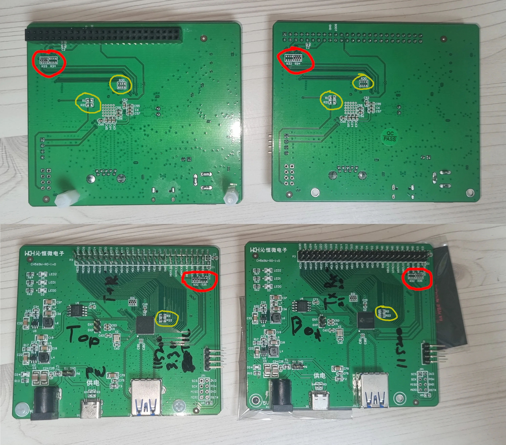

(variant in red, invariant in yellow)

Looking at the both of the boards front and back, you can see that the
resistors are soldered on exactly as described above. To put it in a
table:

| Board(HSPI mode) | R32 | R33 | R34 | R35 |
|-|-|-|-|-|
| Upper(master) | O | O | X | X |
| Lower(slave) | X | X | O | O |

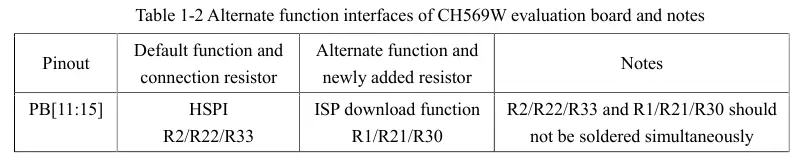

You can deduce that none of the resistors necessary for the ISP download
function are soldered on. So an ISP tool cannot be used out of the box
and it requires some manual soldering if you want ISP. This is why the
ISP pins are not fanned out.

The boards commonly have R2 and R22 soldered on. Therefore, those
resistor configurations in the table(R32+R33: master, R34+R35: slave)
determines the HSPI mode of the board... ?????

### UART

  - TTL Logic Level: 3.3V
  - Baud rate: 115200

The board features 4 UART ports, but the EVB has two of them reserved
for the main console output(UART1) and program downloading(UART3).

You can definitely repurpose them during program init, but as the board
is not physically configured with ISP functions, unless you solder the
resistors and fan out the ISP pins, you're stuck with using the UART3 as
the only means of getting flash memory data in and out of the board.

I'd recommend using two USB-UART converts for each port for your set up.

## Powering the Board

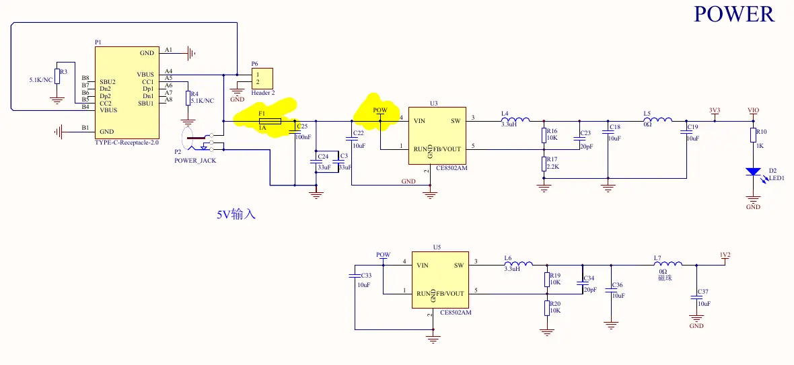
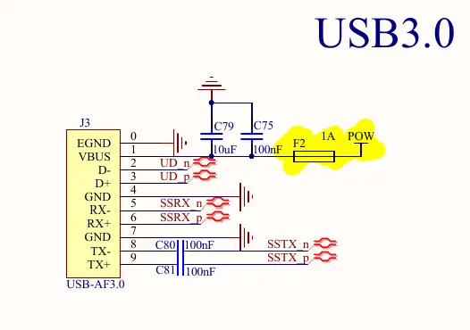

The DC jack, the 5V jumper(P6), the USB-C and the USB-A are all
connected to the same VIN bus connected to the regulators(U5 and U3).
The board can be powered from any one of them.

Note that one 1A fuse(F1) is shared among the DC jack, the jumper and
the USB-C whilst the USB-A has a dedicated 1A fuse(F2) bypassing the
former. This means that even if F1 fails, the board can still be powered
off the USB-A.

When the board is powered, the factory-flashed program prints these
lines out to UART1, which is fanned out to the side of the board.

```sh
$ stty -F /dev/ttyUSB0 115200
$ cat /dev/ttyUSB0
...
System Clock=120000000

HSPI XXX MODE

```
where XXX is either `Master` or `Slave`.

## Connect UART3 for Download Functions

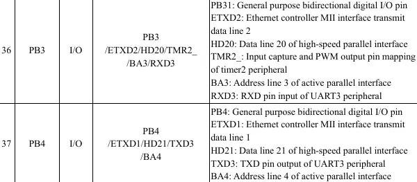

  - Rx: HD20
  - Tx: HD21

Connect these pins to your USB-UART converter. Grab any of GND pins for
the UART ground.

## Entering "BOOT Mode"

In order to program the flash memory on board, the device first has to
enter the "BOOT mode". The board enters the BOOT mode if the pin HD0 is
pulled low on reset. The pin and the adjacent GND pin is conveniently
labeled on the underside of the board.

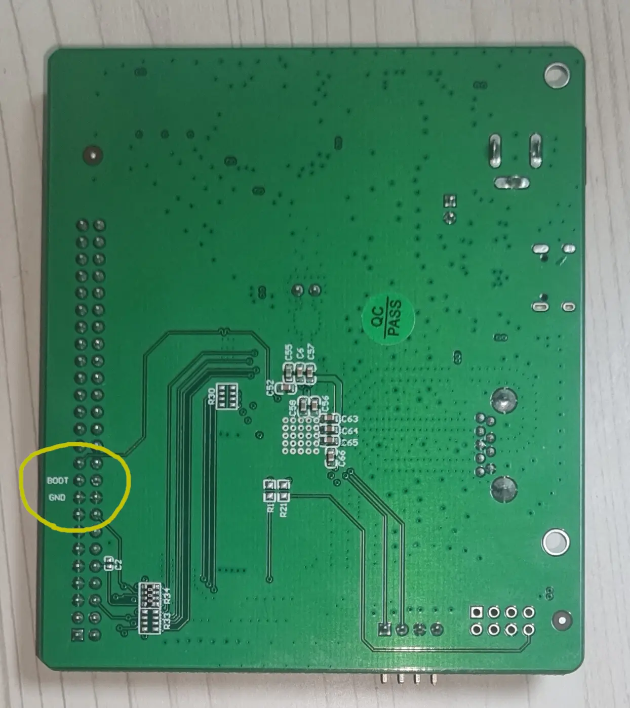

When the board is not powered on, short those two pins and power it up.
You can check if the board has entered the BOOT mode by trying the
download commands using the download tool. It is available both as a
standalone tool(see the links in [README](../README.md)) and an addon
from MounRiver Studio. For the purpose of the tutorial, I'm sticking to
using MounRiver Studio.

  1. Start up MounRiver Studio
  2. Start the ISP tool: `Tools` - `WCH In-System Programmer`
  3. Change the language to English(for some reason, the default is
     Chinese)
  4. Change to CH56x view: `MCU Series View` - `Dedicated MCUs(CH56x)`
  5. Select the Chip Series(CH56x), Chip Model(CH569) and Dnld
     Port(SerialPort)

`Dev List` should show the serial ports. Select the COM port that's
connected to UART3.

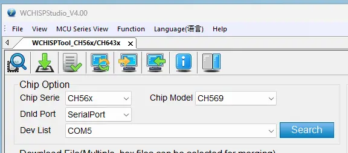

Having done this, go to `Function` - `Edit DataFlash(E)...`. Don't
worry, we're not flashing anything yet. This tool can do other things
than what it says in the name and reading data off the flash is one of
them.

Start reading the data off the flash by clicking on `ReadData`. If your
USB UART converter has Rx/Tx LEDs, they should start flashing vigorously
when the data transfer commences. The transfer is quite fast and will be
done in a few seconds.

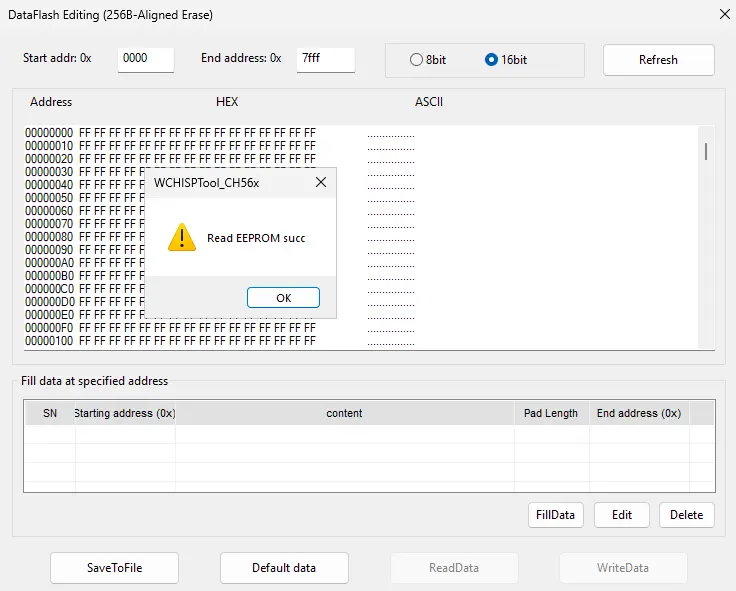

If you get the "succ" message, congratulations, the board is in working
order and ready to be flashed with your program.

You have to be more or less quick when the board is in the BOOT mode
because the board won't stay in the BOOT mode forever. It will start the
user program after some time of inactivity. According to the doc, the
timeout after entering the BOOT mode is 10 seconds. When a download
command has been issued, the timeout after the last UART3 command seems
to be 60 seconds.

## On Resetting Board (you can't, basically)

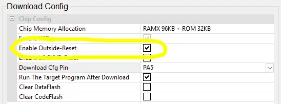

Unfortunately, the board doesn't have a dedicated reset pin. It seems
that the pin PB15/HD14 can be configured to act as the `RST#` pin but it
has to be configured in the flash. It's safe to say that the function is
not implemented at the hardware level.

The `RST#` is probably for providing ISP functions when the board is
configured for them. As mentioned above, if you want to configure the
board for ISP, a few of the HSPI pins need to be sacrificed. This is
just not a good design. The designers probably had to trade off the
`RST#` pin for more GPIO pins which is understandable.

I'd recommend not using the `RST#` at all. Build your set up so that you
can power cycle the board with ease.

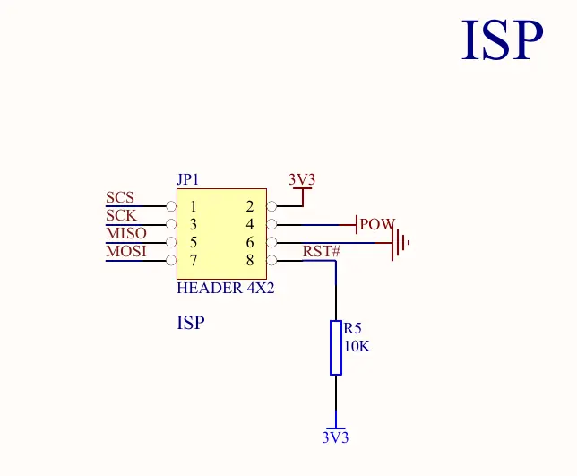

(This is a silly mistake: the pin is actually connected to the pin
through R21/R22, not just to 3.3VBUS)

## Putting It All Together

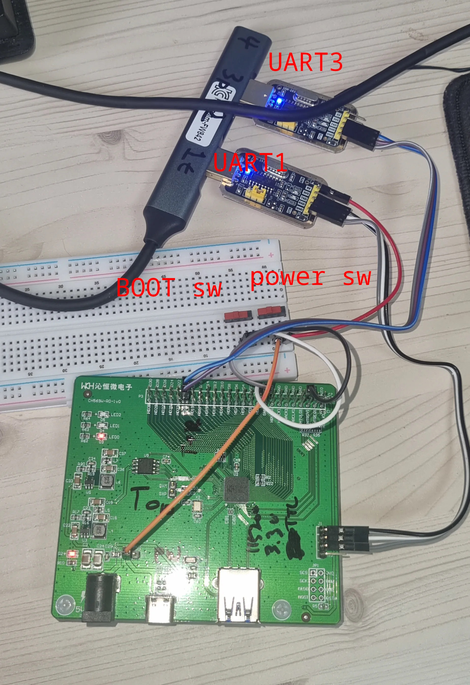

This is my set up(not final!). You might be way better at bread boarding
than me so you're welcome to have your own version, well suited for your
peripherals. My set up is:

  - The board is powered off one of the USB-UART pins(the USB-UART
    passes the 5V USB power from the PC straight through to the board).
    The power from the USB-UART is connected to the slider switch first
    and then to the board's 5V power jumper(P6): `USB-UART 5V -> slider
    switch -> P6`
  - BOOT pin(HD0) is connected to one of the GND pins through the slider
    switch: `BOOT -> slider switch -> GND`

(Could feed the power to the first or the second VIO pin, but those pins
bypass the fuse(F1))

If you're planning to use the board's USB controller, you'll need to
think about how to prevent the USB-A from powering the board because the
power from the USB-A bypasses the power switch.

Options are:

  1. using a "USB power blocker"
  2. cutting and insulating the 5V and GND wires in a USB A to A cable

Up to you.

## MORE

  ⇽ [README.md](../README.md) | [Your First Blink Program](../01-blink-program/README.md) →
