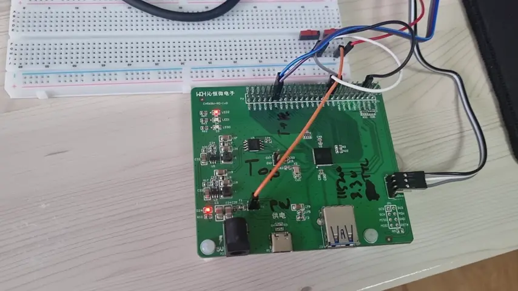
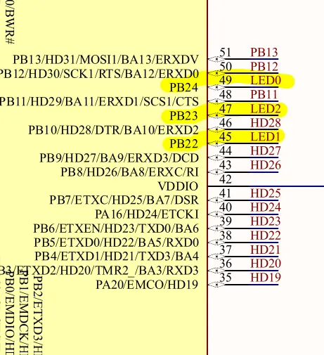
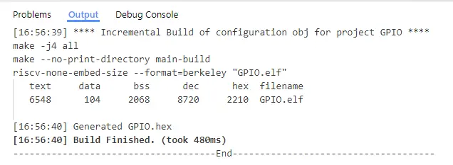
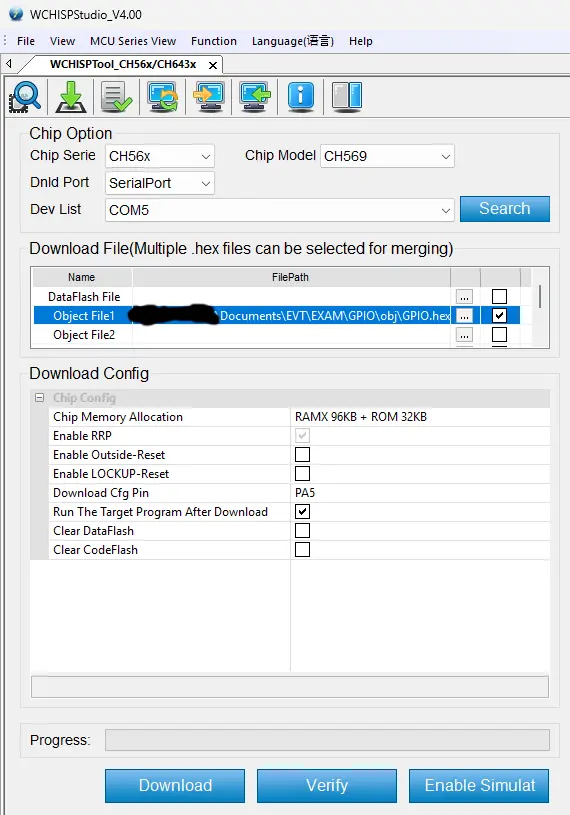

# CH569 Hacking: Your First Blinker Program



The first program Arduino people usually run to test the development
environment for MCU's is the infamous LED blinker program.

First, extract the EVB toolkit zip file which includes some example
programs. We'll use one particular example project named "GPIO" as a
base. It is located in `EVT/EXAM/GPIO`.

Open the project, in `User/Main.c`, replace the main function with the
following:

```c
int main()
{
	SystemInit(FREQ_SYS);
	Delay_Init(FREQ_SYS);

/* Configure serial debugging */
	DebugInit(115200);
	PRINT("Start @ChipID=%02X\r\n", R8_CHIP_ID );

	unsigned int a = 0, b = 0;

	GPIOB_ModeCfg(GPIO_Pin_22, GPIO_ModeOut_OP_8mA);
	GPIOB_ModeCfg(GPIO_Pin_23, GPIO_ModeOut_OP_8mA);
	GPIOB_ModeCfg(GPIO_Pin_24, GPIO_ModeOut_OP_8mA);
	GPIOB_SetBits(GPIO_Pin_22);
	GPIOB_SetBits(GPIO_Pin_23);
	GPIOB_SetBits(GPIO_Pin_24);

	PRINT("hello, world!\r\n");

	for (;;) {
		switch (a) {
		case 0:
			GPIOB_ResetBits(GPIO_Pin_22);
			GPIOB_SetBits(GPIO_Pin_23);
			GPIOB_SetBits(GPIO_Pin_24);

			PRINT(b & 1 ? "ho!\r\n" : "hey!\r\n");
			b++;
			break;
		case 1:
			GPIOB_SetBits(GPIO_Pin_22);
			GPIOB_ResetBits(GPIO_Pin_23);
			GPIOB_SetBits(GPIO_Pin_24);
			break;
		case 2:
			GPIOB_SetBits(GPIO_Pin_22);
			GPIOB_SetBits(GPIO_Pin_23);
			GPIOB_ResetBits(GPIO_Pin_24);
			break;
		}

		a = (a + 1) % 3;

		mDelaymS(250);
	}
}
```

As the chip has many pins, the board has several different pin naming
schemes. One of the scheme is the "A/B grouping scheme". In this
sceheme, the pin number 22 of group B is refer to as `PB22` in the
datasheet. If a GPIO port is fanned out as one of the HSPI pins, it's
also labeled like `HD5/PA1`.

For the sake of the tutorial, I will use the A/B naming schem. Use
`GPIOA_ModeCfg()` and `GPIOB_ModeCfg()` to configure GPIO pin group A
and GPIO pin group B, respectively. Use `GPIOA_SetBits()` and
`GPIOA_ResetBits()` to pull the pins of GPIO group A. Same story for
`GPIOB_SetBits()` and `GPIOB_ResetBits()`.




(the chip pin out, rotated 90 degrees clockwise)

The three LEDs on the board are connected to the chip like so

| LED | GPIO PIN |
|-|-|
| 0 | PB24 |
| 1 | PB22 |
| 2 | PB23 |

Just like many other boards are wired, clearing the bit(pulling low)
turns on the LED and setting the bit(pulling high) turns it off.

## Flashing the Program

Only the download functions are supported through UART3 so,
unfortunately, you can't use any of the debugging features of MounRiver
Studio. Again, if you want ISP, you need to do some soldering to
reconfigure the 0-ohm resistors and trade in some HSPI pins to fan out
the ISP pins.



To flash your first blinker program, first build the project(F7 key).
The output "hex file" will be placed in the project directory and you
flash this file using the download tool manually.

  1. Open the download tool(see the previous chapter)
  2. Set `Object File1` to the path to the built "hex file"
  3. Make sure the board in the BOOT mode by power cycling it with the
     BOOT pin shorted to GND
  4. Click the `Download` button

Before starting the download, if you check `Run The Target Program After
Download`, the board will do just that.



## What Now?

(TODO)

If you hate Microsoft and Windows with every fibre of your being like I
do, you'd probably be disgusted by the very fact that the toolchains
provided by the vendor are all pre-built binaries and GUI. If you're a
Linux dev, you probably have a text editor or an IDE of your taste and
have affinity for Makefile and shell scripting.

Let's fix that, the FOSS style: build the GCC+binutils and the non-GUI
download tool from scratch on Linux.

## MORE

  ⇽ [Basics](../00-basics/README.md) | TODO →
